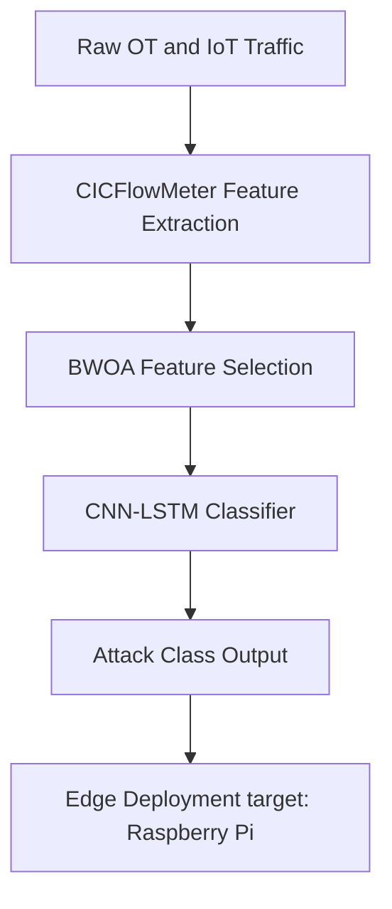
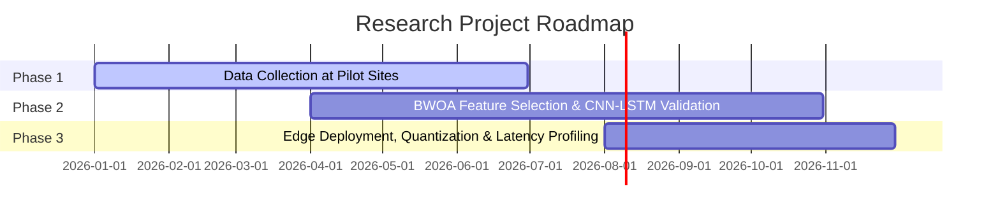

# Securing the Digital Mine

[](https://www.python.org/)
[](https://tensorflow.org)
[](https://opensource.org/licenses/MIT)
[](http://unesco.org)

## Overview
This repository hosts the research and development codebase for a metaheuristic optimized deep learning framework designed to secure IoT-enabled mining control networks. By combining a Binary Whale Optimization Algorithm (BWOA) for lightweight feature selection with a spatial-temporal CNN-LSTM neural network classifier, this system secures Operational Technology (OT) and SCADA environments against network intrusion. The framework is optimized specifically for Raspberry Pi-class edge hardware, targeting detection latency under 100ms and memory utilization below 1GB RAM.

---

## Architecture Diagram
The flowchart below illustrates the packet lifecycle from initial network ingestion down to edge prediction outputs:



---

## Three-Phase Roadmap
The roadmap for model development, adaptation, and hardware testing is scheduled as follows:



---

## System Architecture
This block diagram outlines the modular structure of the repository, highlighting data ingestion, model processing, and edge assessment blocks:

```mermaid
block-beta
    columns 3
    block:data_block["Data Ingestion & Loaders"]
        nsl["NSL-KDD Loader"]
        swat["SWaT Loader"]
        batadal["BATADAL Loader"]
        ot["OT Collector"]
    end
    block:model_block["Model & Optimization Pipeline"]
        bwoa["BWOA Optimizer"]
        fitness["Fitness Evaluation"]
        cnn_lstm["CNN-LSTM Model"]
        trainer["Model Trainer"]
    end
    block:eval_block["Evaluation & Utilities"]
        metrics["Performance Metrics"]
        edge["Edge Benchmark"]
        logs["Structured Logger"]
        viz["Visualizer"]
    end
    data_block --> model_block
    model_block --> eval_block
```



---

## Project Structure
```text
.
├── .ai/
│   ├── context.md
│   ├── rules.md
│   └── skills.md
├── data/
│   ├── features/
│   │   └── .gitkeep
│   ├── processed/
│   │   └── .gitkeep
│   └── raw/
│       └── .gitkeep
├── logs/
│   └── .gitkeep
├── models/
│   └── .gitkeep
├── notebooks/
│   ├── 01_eda_nslkdd.ipynb
│   ├── 02_bwoa_feature_selection.ipynb
│   ├── 03_cnn_lstm_baseline.ipynb
│   ├── 04_ot_traffic_adaptation.ipynb
│   └── 05_edge_deployment_benchmark.ipynb
├── src/
│   ├── data/
│   │   ├── __init__.py
│   │   ├── batadal.py
│   │   ├── nsl_kdd.py
│   │   ├── ot_collector.py
│   │   └── swat.py
│   ├── evaluation/
│   │   ├── __init__.py
│   │   ├── edge_benchmark.py
│   │   └── metrics.py
│   ├── models/
│   │   ├── __init__.py
│   │   ├── cnn_lstm.py
│   │   └── trainer.py
│   ├── optimization/
│   │   ├── __init__.py
│   │   ├── bwoa.py
│   │   └── fitness.py
│   └── utils/
│       ├── __init__.py
│       ├── logger.py
│       └── visualizer.py
├── tests/
│   ├── test_bwoa.py
│   ├── test_cnn_lstm.py
│   └── test_metrics.py
├── config.yaml
├── requirements.txt
└── README.md
```

---

## Quick Start

### 1. Installation
Clone the repository and install all development dependencies:
```bash
git clone https://github.com/mhiskall282/unesco-project.git
cd unesco-project
pip install -r requirements.txt
```

### 2. Set Up Datasets
Place raw datasets in the designated directories:
- NSL-KDD: `data/raw/KDDTrain+.txt` and `data/raw/KDDTest+.txt`
- SWaT: `data/raw/swat.csv`
- BATADAL: `data/raw/batadal.csv`

### 3. Run Verification Tests
Verify compilation and core mathematical functions locally:
```bash
python -m unittest discover -s tests
```

---

## Experimental Results
Baseline results obtained on the NSL-KDD benchmark dataset:

| Dataset | Accuracy | Precision | Recall | F1 | Latency |
| :--- | :---: | :---: | :---: | :---: | :---: |
| NSL-KDD Baseline | 0.0000 | 0.0000 | 0.0000 | 0.0000 | 0.0ms |
| SWaT Adaptation | 0.0000 | 0.0000 | 0.0000 | 0.0000 | 0.0ms |
| BATADAL Adaptation| 0.0000 | 0.0000 | 0.0000 | 0.0000 | 0.0ms |

---

## SDG Alignment and Sustainable Impact
This project supports three United Nations Sustainable Development Goals (SDGs):
- **SDG 9: Industry, Innovation, and Infrastructure**: Builds cyber resilience for critical mining networks, promoting sustainable industrial automation.
- **SDG 8: Decent Work and Economic Growth**: Reduces industrial accidents and operational downtime caused by malicious system manipulations.
- **SDG 17: Partnerships for the Goals**: Collaboratively links technical research and development teams between Ghana and Russia under UNESCO's patronage.

---

## Citation
If you reference this research project in your academic publications, please use the citation below:

```bibtex
@inproceedings{okyere2026securing,
  author    = {Okyere, John},
  title     = {Securing the Digital Mine: A Metaheuristic Optimized Deep Learning Framework for Intrusion Detection in IoT Enabled Mineral Resource Operations},
  booktitle = {Proceedings of the Russian-African Forum-Contest of Young Scientists: Future Engineers of the World: The Foundation of Sustainable Development},
  publisher = {Empress Catherine II Saint Petersburg Mining University},
  year      = {2026},
  address   = {Saint Petersburg, Russia},
  month     = {October}
}
```

---

## Team
- **John Okyere** (Team Lead): Full-Stack Engineer, MSc Computer Science candidate (University of Ghana), BSc ICT Education candidate (University of Education, Winneba, Ghana). John is the Co-founder and Technical Lead at Kayaba Labs, an ICP Ambassador, and has trained over 600 developers.

---

## References
- Mirjalili, S., & Lewis, A. (2016). The Whale Optimization Algorithm. *Advances in Engineering Software*, 95, 51:67. https://doi.org/10.1016/j.advengsoft.2016.01.008
- Kheddar, H., Himeur, Y., & Awad, A. (2023). Deep transfer learning for industrial control systems intrusion detection: A systematic review. *Journal of Network and Computer Applications*, 214, 103597. https://doi.org/10.1016/j.jnca.2023.103597
- Alanazi, M., Mahmood, A., & Chowdhury, M. J. M. (2022). SCADA vulnerabilities and attacks: A systematic review. *Computers & Security*, 125, 103028. https://doi.org/10.1016/j.cose.2022.103028
- Almomani, A., Akour, M., & Habeb, M. (2025). Cyberattack detection for SCADA systems in IIoT environments. *Symmetry*, 17(4), 480. https://doi.org/10.3390/sym17040480
- Krishnaveni, S., et al. (2025). Hybrid metaheuristic intrusion detection system for wireless sensor networks in industrial environments. *Cluster Computing*, 28, 5248. https://doi.org/10.1007/s10586-024-04612-x
- Anand, P., & Arul, R. (2024). Whale Optimization Algorithm enhanced LSTM for intrusion detection. *Cryptography*, 8(4), 73. https://doi.org/10.3390/cryptography8040073

---

## License
Distributed under the MIT License. See [LICENSE](LICENSE) for more information.
