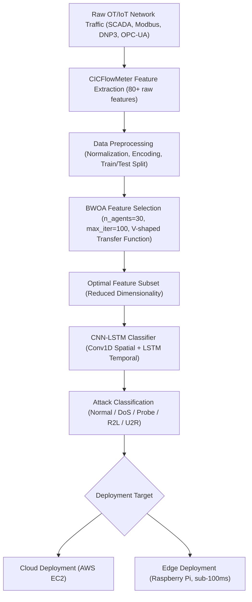
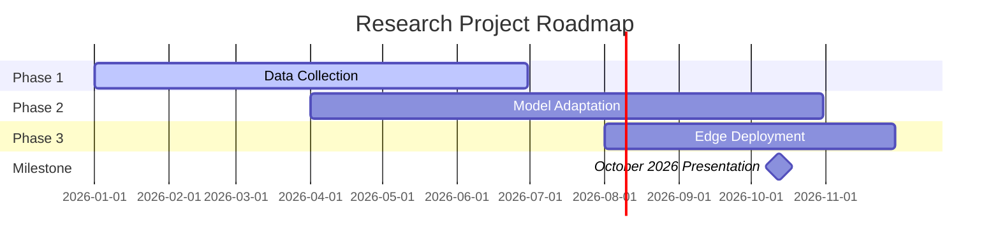
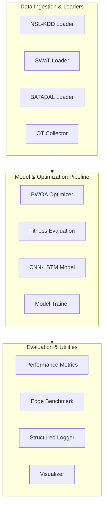
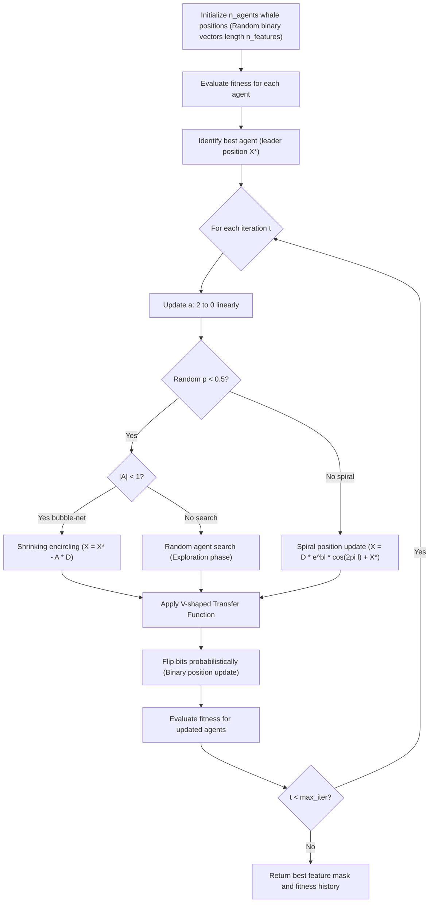

# Securing the Digital Mine

> A Metaheuristic Optimized Deep Learning Framework for Intrusion Detection in IoT Enabled Mineral Resource Operations

[](https://python.org)
[](https://tensorflow.org)
[](LICENSE)
[](https://youthafrica.spmi.ru)
[](https://youthafrica.spmi.ru/en/participants)

African and Russian mining operations are digitalizing faster than their cybersecurity posture can keep pace. This project adapts a Binary Whale Optimization Algorithm combined with a CNN-LSTM deep learning classifier, validated on NSL-KDD, toward the distinct traffic patterns of mining IoT and SCADA infrastructure. The framework is purpose-built for edge deployment in resource-constrained African mining environments.

**Competition:** Russian-African Forum-Contest of Young Scientists 2026, Saint Petersburg Mining University, Russia  
**Track:** Track 3 "Smart Subsoil", focusing on Digital Transformation and Automation in the Mineral Resources Complex  
**Event Dates:** 12 to 17 October 2026

---

## System Architecture
The flowchart below illustrates the packet lifecycle from initial network ingestion down to edge prediction outputs:



---

## Three-Phase Research Roadmap
The development phases and timelines, showing the milestone presentation in October 2026:



---

## Pipeline Overview
The modular structures of our data pipeline, model training, and edge evaluations:



---

## Repository Structure
```text
.
├── .ai/
│   ├── context.md
│   ├── rules.md
│   └── skills.md
├── data/
│   ├── features/
│   │   └── .gitkeep
│   ├── processed/
│   │   └── .gitkeep
│   └── raw/
│       └── .gitkeep
├── docs/
│   ├── api_reference.md
│   ├── architecture.md
│   ├── bwoa_algorithm.md
│   ├── contribution_guide.md
│   ├── dataset_guide.md
│   ├── experiment_guide.md
│   └── results.md
├── figures/
│   └── .gitkeep
├── logs/
│   └── .gitkeep
├── models/
│   └── .gitkeep
├── notebooks/
│   ├── 01_eda_nslkdd.ipynb
│   ├── 02_bwoa_feature_selection.ipynb
│   ├── 03_cnn_lstm_baseline.ipynb
│   ├── 04_ot_traffic_adaptation.ipynb
│   └── 05_edge_deployment_benchmark.ipynb
├── src/
│   ├── data/
│   │   ├── __init__.py
│   │   ├── batadal.py
│   │   ├── nsl_kdd.py
│   │   ├── ot_collector.py
│   │   └── swat.py
│   ├── evaluation/
│   │   ├── __init__.py
│   │   ├── edge_benchmark.py
│   │   └── metrics.py
│   ├── models/
│   │   ├── __init__.py
│   │   ├── cnn_lstm.py
│   │   └── trainer.py
│   ├── optimization/
│   │   ├── __init__.py
│   │   ├── bwoa.py
│   │   └── fitness.py
│   └── utils/
│       ├── __init__.py
│       ├── logger.py
│       └── visualizer.py
├── tests/
│   ├── test_bwoa.py
│   ├── test_cnn_lstm.py
│   └── test_metrics.py
├── config.yaml
├── LICENSE
├── requirements.txt
└── README.md
```

---

## Quick Start

### 1. Installation
Clone the repository and install all dependencies:
```bash
git clone https://github.com/mhiskall282/unesco-project.git
cd unesco-project
pip install -r requirements.txt
```

### 2. Set Up Datasets
Place raw datasets in the designated directories:
- NSL-KDD: `data/raw/KDDTrain+.txt` and `data/raw/KDDTest+.txt`
- SWaT: `data/raw/swat.csv`
- BATADAL: `data/raw/batadal.csv`

### 3. Run Experiments
Execute the notebooks sequentially or run unit tests to verify local setup:
```bash
python -m unittest discover -s tests
```

---

## Experiment Results

| Dataset | Accuracy | Precision | Recall | F1 | Latency (ms) |
| :--- | :---: | :---: | :---: | :---: | :---: |
| NSL-KDD (baseline) | 0.7870 | 0.8231 | 0.7870 | 0.7657 | 68.27ms |
| NSL-KDD + BWOA | 0.6783 | 0.7637 | 0.6783 | 0.7052 | 35.60ms |
| SWaT (adapted) | TBD | TBD | TBD | TBD | TBD |
| Custom OT Dataset | TBD | TBD | TBD | TBD | TBD |

---

## BWOA Feature Selection
The optimization lifecycle runs iteratively through encircling, exploration, and bubble-net search mechanisms:



---

## SDG Alignment

| SDG | Goal | How This Project Contributes |
| :--- | :--- | :--- |
| SDG 9 | Industry, Innovation and Infrastructure | Strengthens cybersecurity resilience of digitalizing mining infrastructure. |
| SDG 8 | Decent Work and Economic Growth | Protects worker safety and operational continuity at mining operations. |
| SDG 17 | Partnerships for the Goals | Russian-African collaborative data collection and research pathway. |

---

## Team
- **John Okyere**: Team Lead, AI Security Researcher (University of Education, Winneba and University of Ghana; Co-founder, Kayaba Labs; ICP Ambassador; johnokyere.xyz).
- **[Team Member 2]**: Researcher, SCADA/IIoT Data Acquisition Specialist.
- **[Team Member 3]**: Edge Deployment and Quantization Engineer.

---

## Citation
If you reference this research project in your publications, please cite the work below:

```bibtex
@inproceedings{okyere2026securing,
  author    = {Okyere, John},
  title     = {Securing the Digital Mine: A Metaheuristic Optimized Deep Learning Framework for Intrusion Detection in IoT Enabled Mineral Resource Operations},
  booktitle = {Proceedings of the Russian-African Forum-Contest of Young Scientists: Future Engineers of the World: The Foundation of Sustainable Development},
  publisher = {Empress Catherine II Saint Petersburg Mining University},
  year      = {2026},
  address   = {Saint Petersburg, Russia},
  month     = {October}
}
```

---

## References
1. Mirjalili, S., & Lewis, A. (2016). The whale optimization algorithm. *Advances in Engineering Software*, 95, 51:67. https://doi.org/10.1016/j.advengsoft.2016.01.008
2. Kheddar, H., Himeur, Y., & Awad, A. I. (2023). Deep transfer learning for intrusion detection in industrial control networks. *Journal of Network and Computer Applications*. https://doi.org/10.48550/arXiv.2304.10550
3. Alanazi, M., Mahmood, A., & Chowdhury, M. J. M. (2022). SCADA vulnerabilities and attacks. *Computers & Security*, 125, 103028. https://doi.org/10.1016/j.cose.2022.103028
4. Almomani, O., Akour, I., & Habeb, A. (2025). Cyberattack detection for SCADA in IIoT. *Symmetry*, 17(4), 480. https://doi.org/10.3390/sym17040480
5. Krishnaveni, S., Chen, T. M., Sivamohan, S., & Subbiah, S. (2025). Hybrid metaheuristic IDS for WSN. *Cluster Computing*, 28, 5248. https://doi.org/10.1007/s10586-025-05248-6
6. Anand, M., & Arul, U. (2024). WOA enhanced LSTM for intrusion detection. *Cryptography*, 8(4), 73. https://doi.org/10.3390/cryptography8040073

---

## License
Distributed under the MIT License. See `LICENSE` for more details.
