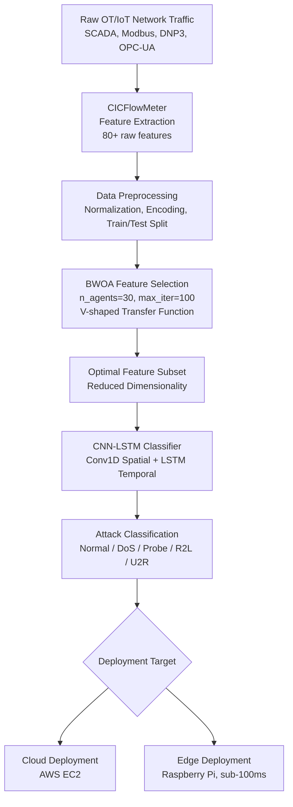
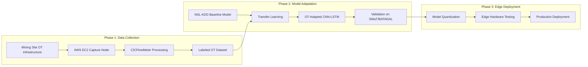

# System Architecture and Methodology

This document outlines the high-level system architecture and research methodology for "Securing the Digital Mine".

---

## 1. Pipeline Architecture
The system processes raw IoT/OT telemetry in a pipeline, mapping network packets onto compressed feature spaces for deep learning classification. The complete packet lifecycle from network sniffing to localized edge inference:

### Ingestion and Extraction
Raw network streams (SCADA protocol headers, packet structures, payload elements) are captured. CICFlowMeter generates flow-based bidirectional statistics.

### Preprocessing and Normalization
Extracted features are mapped, label-encoded, split, and normalized via Standard Scaler to avoid feature skew.

### Binary Whale Optimization Algorithm (BWOA)
A metaheuristic wrapper runs over candidate feature subsets, searching for an optimal binary feature mask. This operates under a fitness function balancing error rate minimization with maximum dimensionality reduction.

### CNN-LSTM Classifier
A hybrid neural network. Conv1D layers extract spatial correlations from network sequence metrics. LSTM layers model the temporal patterns over packet flow time-steps.

### Target Deployment
The final compressed model is quantized and compiled for local low-power execution (Raspberry Pi devices) or cloud dashboards (AWS EC2).

---

## 2. Research Phases
The research workflow comprises three concurrent phases of development and field testing:

### Phase 1: OT Data Collection
Focuses on capturing traffic logs directly from pilot subsoil plants, generating flow statistics, and building a site-specific labeled custom OT dataset.

### Phase 2: Model Adaptation
Validates baseline models on benchmark databases (NSL-KDD), runs the BWOA wrapper, and implements transfer learning. CNN spatial layers are frozen while LSTM layers are retrained to adapt the system to the unique characteristics of mine sites.

### Phase 3: Edge Deployment
Compiles trained models into quantized TFLite representations. Measures memory allocation limits and latency constraints to prove production readiness on constrained local Raspberry Pi-class devices.
