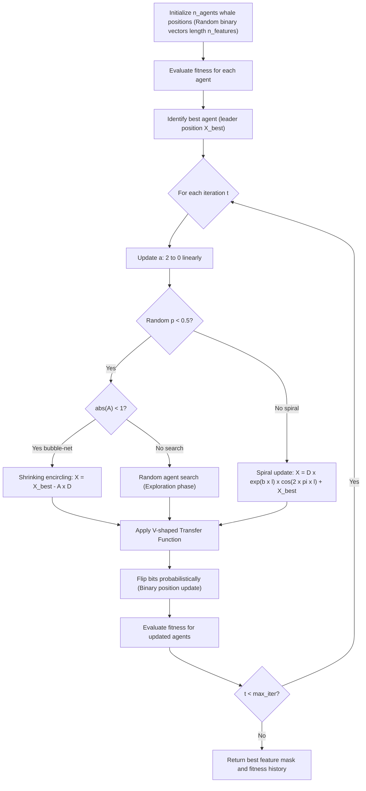

# Binary Whale Optimization Algorithm (BWOA)

This document details the mathematical model and search flowchart for the Binary Whale Optimization Algorithm (BWOA) used for feature subset selection.

---

## 1. Flowchart
The optimization lifecycle runs iteratively through encircling, exploration, and bubble-net search mechanisms:

---

## 2. Mathematical Formulation

The BWOA models the social behaviors of humpback whales using three distinct movement mechanisms:

### Encircling Prey
Whales identify the location of prey and encircle them. The position update is formulated as:
$$\mathbf{D} = \left| \mathbf{C} \cdot \mathbf{X}^*(t) - \mathbf{X}(t) \right|$$
$$\mathbf{X}(t+1) = \mathbf{X}^*(t) - \mathbf{A} \cdot \mathbf{D}$$

Where:
* $t$ represents the current iteration.
* $\mathbf{X}^*(t)$ is the position vector of the best solution (prey/leader) obtained so far.
* $\mathbf{X}(t)$ is the position vector of the current agent.
* $\mathbf{A}$ and $\mathbf{C}$ are coefficient vectors:
  $$\mathbf{A} = 2a\mathbf{r} - a$$
  $$\mathbf{C} = 2\mathbf{r}$$
  Here, $a$ decreases linearly from 2 to 0 over iterations, and $\mathbf{r}$ is a random vector in $[0, 1]$.

### Bubble-Net Attack (Spiral Update)
Whales swim around the prey in a shrinking circle and along a spiral-shaped path. The spiral equation is:
$$\mathbf{X}(t+1) = \mathbf{D}' \cdot e^{bl} \cdot \cos(2\pi l) + \mathbf{X}^*(t)$$

Where:
* $\mathbf{D}' = \left| \mathbf{X}^*(t) - \mathbf{X}(t) \right|$ represents the distance of the whale to the prey.
* $b$ is a constant defining the logarithmic spiral shape.
* $l$ is a random number in $[-1, 1]$.

Whales choose between shrinking encircling and the spiral model with a 50% probability:
$$\mathbf{X}(t+1) = \begin{cases} \mathbf{X}^*(t) - \mathbf{A} \cdot \mathbf{D} & \text{if } p < 0.5 \\ \mathbf{D}' \cdot e^{bl} \cdot \cos(2\pi l) + \mathbf{X}^*(t) & \text{if } p \ge 0.5 \end{cases}$$

### Exploration (Search for Prey)
When $|\mathbf{A}| \ge 1$, whales perform a random search based on the position of a randomly chosen agent $\mathbf{X}_{\text{rand}}$:
$$\mathbf{D} = \left| \mathbf{C} \cdot \mathbf{X}_{\text{rand}} - \mathbf{X}(t) \right|$$
$$\mathbf{X}(t+1) = \mathbf{X}_{\text{rand}} - \mathbf{A} \cdot \mathbf{D}$$

---

## 3. Binary Adaptation and V-Shaped Transfer Function

To apply the Whale Optimization Algorithm to discrete feature selection (binary space), continuous position changes are mapped to probability thresholds. We utilize a V-shaped transfer function to convert continuous step updates $\mathbf{V}$ to probability mappings:

$$T(v) = \left| \frac{2}{\pi} \arctan\left(\frac{\pi}{2} v\right) \right|$$

Alternatively, the V-shaped mapping is calculated as:
$$T(v) = \left| \frac{v}{\sqrt{1 + v^2}} \right|$$

The position of each search agent is updated by comparing the probability $T(v)$ to a random threshold $r \in [0, 1]$:
$$x_{i,j}(t+1) = \begin{cases} 1 - x_{i,j}(t) & \text{if } r < T(v_{i,j}(t+1)) \\ x_{i,j}(t) & \text{otherwise} \end{cases}$$

---

## 4. Fitness Function Formulation

The feature selection wrapper optimizes a multi-objective function, maximizing classification performance while minimizing the feature count:

$$\text{Fitness} = \alpha \times \left( \frac{N_{\text{selected}}}{N_{\text{total}}} \right) + (1 - \alpha) \times \text{Error Rate}$$

Where:
* $\text{Error Rate} = 1 - \text{Accuracy}$ on 3-fold stratified cross validation splits (using RandomForest proxy).
* $N_{\text{selected}}$ is the number of active features in the current mask.
* $N_{\text{total}}$ is the total number of features (e.g., 41 for NSL-KDD).
* $\alpha \in [0, 1]$ is a weight parameter. In v3, $\alpha = 0.3$ to prioritize classification accuracy (70%) over feature reduction (30%).

**Accuracy Floor Constraint**: Any feature subset yielding validation accuracy below the threshold $\tau$ (default: $\tau = 0.75$) is assigned the maximum fitness penalty of 1.0 and rejected:

$$\text{Fitness} = \begin{cases} 1.0 & \text{if Accuracy} < \tau \text{ (floor constraint)} \\ \alpha \times \frac{N_{\text{selected}}}{N_{\text{total}}} + (1-\alpha) \times (1 - \text{Accuracy}) & \text{otherwise} \end{cases}$$
